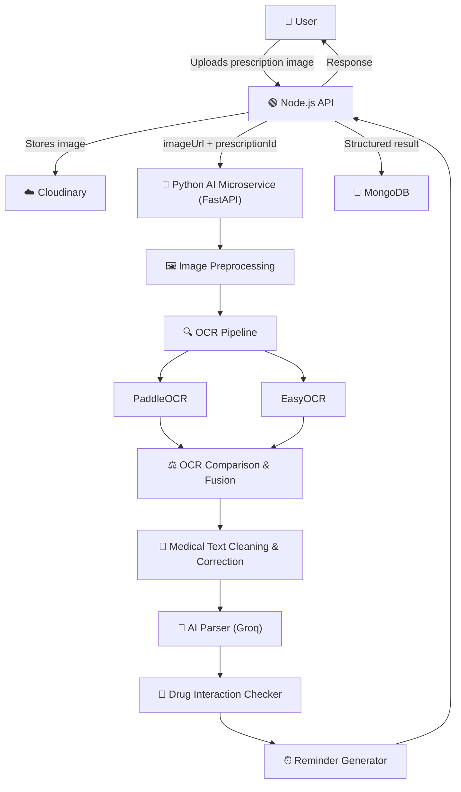

<div align="center">

# 💊 SmartPrescription AI

### AI-Powered Prescription Digitization & Drug Safety Engine

*Turning handwritten prescriptions into structured, actionable medical data.*

[](https://nodejs.org)
[](https://fastapi.tiangolo.com)
[](https://www.mongodb.com)
[](https://redis.io)
[](#-license)
[](#-roadmap)

[Overview](#-overview) • [Features](#-features) • [Architecture](#-architecture) • [OCR Pipeline](#-ocr-pipeline) • [Installation](#-installation) • [API](#-api-reference) • [Postman](#-api-documentation-postman) • [Roadmap](#-roadmap)

</div>

---

## 📖 Overview

**SmartPrescription AI** is a two-service system that reads handwritten medical prescriptions and converts them into clean, structured, machine-readable data.

Handwritten prescriptions are notoriously hard for a single OCR engine to read accurately — medical shorthand, inconsistent handwriting, and scan noise all get in the way. SmartPrescription AI addresses this by running **multiple OCR engines in parallel**, comparing and fusing their output, correcting the result against a medical-term dictionary, and then handing it to an LLM for structured parsing — with every low-confidence field explicitly flagged for human review rather than silently guessed.

> [!NOTE]
> **Project Status: Version 1.** It currently ships as two independently runnable services (a Node.js API and a Python AI microservice) with no containerization or deployment tooling yet — see the [Roadmap](#-roadmap) for what's planned next.

---

## ✨ Features

<table>
<tr><td>

**Backend (Node.js)**
- ✔️ JWT-based user authentication (bcrypt password hashing)
- ✔️ Prescription image upload
- ✔️ Cloud image storage via Cloudinary
- ✔️ Queued reminder generation (BullMQ + Redis)
- ✔️ MongoDB persistence via Mongoose
- ✔️ REST API layer orchestrating the AI microservice

</td><td>

**AI Microservice (Python)**
- ✔️ Multi-engine OCR pipeline (PaddleOCR + EasyOCR)
- ✔️ OCR result comparison & fusion
- ✔️ Medical-text cleaning & dictionary correction
- ✔️ LLM-based structured parsing (Groq)
- ✔️ Drug interaction detection
- ✔️ Confidence-based review flagging

</td></tr>
</table>

---

## 🏗️ Architecture



<details>
<summary><b>📦 Request lifecycle (click to expand)</b></summary>

1. User uploads a prescription image through the Node.js API.
2. The image is stored in Cloudinary; the resulting URL is passed to the Python AI microservice.
3. The AI microservice downloads, preprocesses, and runs the image through both OCR engines.
4. Results are compared, fused, cleaned, and corrected against a medical dictionary.
5. The corrected text is parsed into structured data (medicines, dosage, frequency, duration) via Groq.
6. Detected medicines are checked for drug interactions and used to generate reminder schedules.
7. Any field with low OCR confidence is explicitly flagged in `needsUserReview` for manual verification.
8. The structured result is returned to the Node.js API, persisted in MongoDB, and sent back to the user.

</details>

---

## 🔬 OCR Pipeline

```
📷 Image Upload
     │
     ▼
🖼️  Preprocessing & Enhancement
     │
     ▼
🔍  Parallel OCR
     ├── PaddleOCR
     └── EasyOCR
     │
     ▼
⚖️  OCR Comparison  →  🔗 OCR Fusion
     │
     ▼
🧹  Medical Text Cleaning
     │
     ▼
📚  Dictionary-Based Correction
     │
     ▼
🧠  AI Parsing (Groq)
     │
     ▼
💊  Medicine Validation
     │
     ▼
⚠️  Drug Interaction Check
     │
     ▼
📤  Structured Response + Review Flags
```

Each OCR engine returns a candidate reading with an engine name, image variant, and confidence score. The pipeline picks the best-scoring candidate for reference while also producing a **fused** result from all engines, which typically recovers characters that any single engine misread. The final text is cleaned and corrected before it ever reaches the parser, and every medicine entry that fails a confidence threshold is surfaced back to the user instead of being silently trusted.

---

## 📂 Folder Structure

<details>
<summary><b>🐍 AI Microservice (Python / FastAPI)</b></summary>

```
ai-service/
├── main.py                        # FastAPI app entrypoint
├── requirements.txt
└── src/
    ├── config/
    │   └── settings.py             # Environment-driven configuration
    ├── routers/
    │   └── process.py              # POST /api/v1/process — core pipeline endpoint
    ├── services/
    │   ├── preprocess.py            # Image preprocessing & enhancement
    │   ├── ocr/
    │   │   ├── cleaner.py           # Medical text cleaning
    │   │   └── dictionary.py        # Dictionary-based correction
    │   ├── parser/                  # AI-based prescription parsing (Groq)
    │   ├── interaction/
    │   │   └── drug_interaction.py  # Drug interaction detection
    │   └── reminder/
    │       └── scheduler.py         # Reminder generation logic
    └── utils/
        └── image.py                 # Image download & cleanup helpers
```

</details>

<details>
<summary><b>🟢 Backend API (Node.js / Express)</b></summary>

```
api/
├── src/
│   └── index.js                    # Express app entrypoint
├── package.json
└── .env
```

> The Node.js service is under active development — routes for authentication, prescription management, and reminders are being built out on top of the dependencies listed below.

</details>

---

## ⚙️ Tech Stack

| Layer | Technologies |
|---|---|
| **Backend** | Node.js, Express.js, MongoDB, Mongoose, Redis, BullMQ, JWT, bcrypt, Cloudinary, Multer |
| **AI Service** | Python, FastAPI, PaddleOCR, EasyOCR, OpenCV, Pillow, NumPy, Groq API |

---

## 🚀 Installation

### 1. Clone the repository

```bash
git clone https://github.com/<your-username>/smartprescription-ai.git
cd smartprescription-ai
```

### 2. Backend setup (Node.js)

```bash
cd api
npm install
```

Create a `.env` file inside `api/`:

| Variable | Description |
|---|---|
| `PORT` | Port the Express server runs on |
| `MONGO_URI` | MongoDB connection string |
| `JWT_SECRET` | Secret used to sign JWTs |
| `JWT_EXPIRES_IN` | Access token expiry (e.g. `7d`) |
| `CLOUDINARY_CLOUD_NAME` | Cloudinary account cloud name |
| `CLOUDINARY_API_KEY` | Cloudinary API key |
| `CLOUDINARY_API_SECRET` | Cloudinary API secret |
| `REDIS_URL` | Redis connection string (used by BullMQ) |
| `AI_SERVICE_URL` | Base URL of the Python AI microservice |

Run the backend:

```bash
npm run dev     # development (nodemon)
npm start        # production
```

### 3. AI microservice setup (Python)

```bash
cd ../ai-service
pip install -r requirements.txt
```

Create a `.env` file inside `ai-service/`:

| Variable | Description |
|---|---|
| `PORT` | Port the FastAPI server runs on |
| `GROQ_API_KEY` | API key for Groq (used in AI parsing) |
| `LOG_LEVEL` | Logging verbosity |

Run the AI service:

```bash
uvicorn main:app --reload --port 8000
```

### 4. Required infrastructure

- A running **MongoDB** instance
- A running **Redis** instance (for BullMQ queues)

---

## 📡 API Reference

| Method | Endpoint | Description |
|---|---|---|
| `POST` | `/api/v1/process` | Runs the full pipeline — OCR, fusion, parsing, drug interaction check, and reminder generation — for a given prescription image |

> Additional Node.js API routes (authentication, prescription CRUD, reminders) live in the backend service and will be documented here as they stabilize.

**Sample response:**

```json
{
  "status": "success",
  "prescriptionId": "64f1a2b3c4d5e6f7g8h9i0j1",
  "ocrEngine": "paddleocr",
  "ocrVariant": "enhanced",
  "ocrScore": 92,
  "structuredData": { "medicines": [] },
  "drugInteractions": [],
  "reminders": [],
  "needsUserReview": false,
  "reviewReasons": [],
  "lowConfidenceFields": []
}
```

---

## 📮 API Documentation (Postman)

The complete API documentation and testing collection is available on Postman.

### Features Included

- ✔️ Authentication APIs
- ✔️ Prescription Upload APIs
- ✔️ OCR Processing APIs
- ✔️ AI Parsing APIs
- ✔️ Medicine Validation APIs
- ✔️ Drug Interaction APIs
- ✔️ Reminder APIs

### Open in Postman

👉 **[SmartPrescription AI — Postman Collection](https://sohaibali1277-357479.postman.co/workspace/Sohaib-Arshid's-Workspace~f971752d-0ed6-4cdf-8d41-4cf3c6f43aaf/folder/52978744-038da376-6051-4322-8644-ab431d39b45f?action=share&source=copy-link&creator=52978744)**

You can fork the collection or import it directly into your own Postman workspace.

---

## 🖼️ Screenshots

| Home Page | Upload Flow | OCR Result | AI-Parsed Result |
|---|---|---|---|
| _coming soon_ | _coming soon_ | _coming soon_ | _coming soon_ |

---

## 🗺️ Roadmap

| Version | Status | Scope |
|---|---|---|
| **v1** | ✅ Completed | Multi-engine OCR pipeline, AI parsing, drug interaction detection, reminder generation, Node.js API + MongoDB |
| **v2** | 🚧 Planned | Next.js frontend, user dashboard, Dockerized deployment |
| **v3** | 🔭 Planned | Mobile app, doctor portal, hospital integration, analytics, AI recommendation engine |

---

## 🎓 Learning Outcomes

Building this project involved hands-on work with:

- Designing a **microservice architecture** with Node.js and Python communicating over HTTP
- Building resilient **multi-engine OCR pipelines** with result fusion
- Image preprocessing and enhancement with **OpenCV** and **Pillow**
- Prompt engineering for structured output extraction with **Groq**
- Queue-based background processing with **BullMQ** and **Redis**
- Designing confidence-based review flows instead of blind AI trust

---

## 🧩 Challenges Faced

- **OCR accuracy on handwriting** — no single engine was reliable enough alone, which led to the comparison/fusion approach.
- **Medical vocabulary noise** — raw OCR output needed a dedicated cleaning and dictionary-correction stage before parsing.
- **Cross-language service communication** — coordinating a Node.js API with a Python FastAPI service over HTTP required careful contract design between the two.
- **Avoiding silent errors** — structured parsing needed explicit low-confidence flags so bad reads don't reach reminder scheduling unnoticed.

---

## 📄 License

This project is licensed under the **MIT License**.

---

## 👤 Author

<div align="center">

**Sohaib Arshid**
Full Stack Developer

[](#)
[](#)
[](#)

</div>